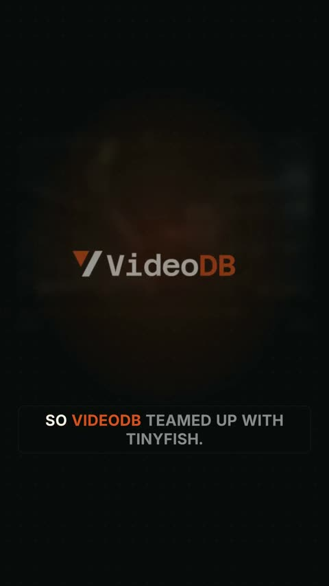
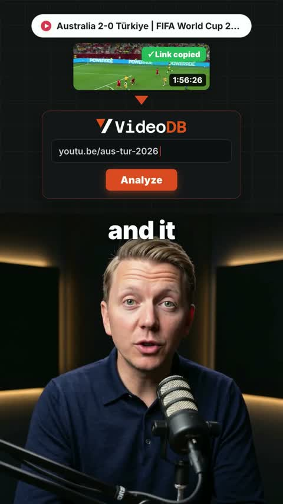
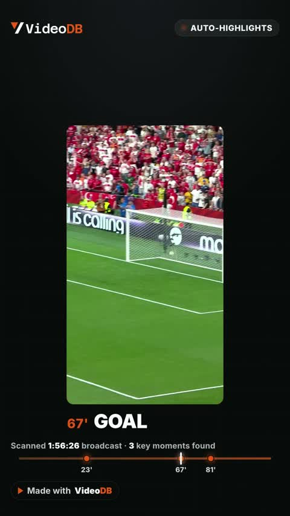
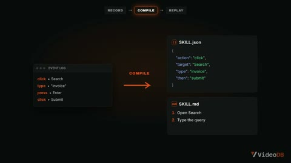
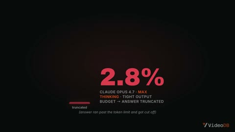
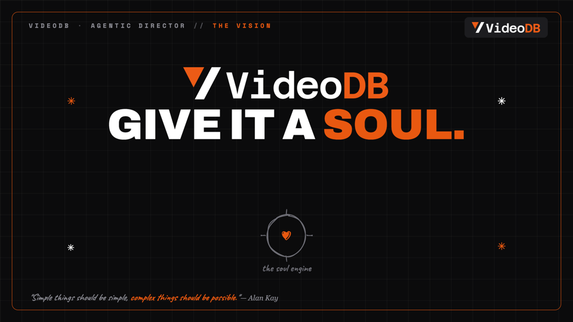

# videodb-video-studio

Six production-tested video pipelines, one install. Built on [HyperFrames](https://www.npmjs.com/package/hyperframes) (HTML + GSAP → rendered MP4), branded for VideoDB out of the box, re-brandable with one JSON file.

| Pipeline | What you get | Canvas | Length |
|---|---|---|---|
| `youtube-longform` | Narrated video-essay / explainer | 1920×1080 · 24fps | 3–5 min |
| `instagram-short` | Vertical short with karaoke captions | 1080×1920 · 30fps | 15–60 s |
| `split-ugc` | Talking-head docks down, cards animate on top | 1080×1920 · 30fps | ~40 s |
| `deck` | HTML slides → PDF + PNGs, hand-drawn art | 16:9 slides | — |
| `demo-recording` | Product launch video + Playwright screen-capture stack | 1920×1080 · 24fps | ~2 min |
| `highlights` | Auto-clips highlights reel | 1080×1920 · 30fps | ~25 s |

Every template is a **full worked example** — a real, finished video that renders as-is with **zero API keys**.

## Demos

Every video below is a template's worked example rendered exactly as it ships (draft quality, zero API keys). Click a thumbnail to watch.

| | | |
|:---:|:---:|:---:|
| [](https://github.com/lastHumanCoder-again/videodb-video-studio/releases/download/v1.0/demo-instagram-short.mp4) | [](https://github.com/lastHumanCoder-again/videodb-video-studio/releases/download/v1.0/demo-split-ugc.mp4) | [](https://github.com/lastHumanCoder-again/videodb-video-studio/releases/download/v1.0/demo-highlights.mp4) |
| **instagram-short** · 40s reel with karaoke captions | **split-ugc** · talking head + animated cards | **highlights** · auto-clips analysis reel |
| [](https://github.com/lastHumanCoder-again/videodb-video-studio/releases/download/v1.0/demo-demo-recording.mp4) | [](https://github.com/lastHumanCoder-again/videodb-video-studio/releases/download/v1.0/demo-youtube-longform.mp4) | [](https://github.com/lastHumanCoder-again/videodb-video-studio/releases/download/v1.0/demo-deck.pdf) |
| **demo-recording** · 2min product launch video | **youtube-longform** · 4min narrated video essay | **deck** · 10-slide PDF with hand-drawn art |

All six are also on the [v1.0 release page](https://github.com/lastHumanCoder-again/videodb-video-studio/releases/tag/v1.0). To rebrand them, pass your own `brand.json` — every accent, glow, and highlight follows it.

## Install

### As a Claude Code skill (recommended)

```bash
git clone https://github.com/lasthumancoder-again/videodb-video-studio ~/.claude/skills/videodb-video-studio
cd ~/.claude/skills/videodb-video-studio && bash install.sh
```

Restart Claude Code, then just say what you want: *"make me an instagram short about semantic video search"*. The skill routes your intent to the right pipeline, scaffolds a project, and walks the full build loop (script → voiceover → transcribe → cue-sync → build → render).

### As a plain CLI toolkit (no Claude Code required)

```bash
git clone https://github.com/lasthumancoder-again/videodb-video-studio
cd videodb-video-studio
python3 scripts/new_project.py instagram-short my-first-short --dir ~/videos
cd ~/videos/my-first-short && npm install && npm run render
```

You get the worked example rendering under your own slug. Then edit `voiceover/segments.json`, the composition HTML, or `build.py` (procedural pipelines) and re-render.

## Prerequisites

- Node.js ≥ 18 (`npx hyperframes` is installed per-project by `npm install`)
- Python 3.9+
- ffmpeg (QA frame extraction)

## Optional API keys (bring your own)

Nothing requires a key. With keys you unlock in-place generation:

| Key | Enables | Without it |
|---|---|---|
| `ELEVENLABS_API_KEY` | `scripts/tts.py` — voiceover from `segments.json` | Script prints your segment texts; generate anywhere, drop MP3s into `voiceover/` |
| `KIE_API_KEY` | `scripts/gen_image.py` — AI images (nano-banana-pro) | Script prints a paste-ready prompt block; save the image to the given path |

Keys live in `workspace/.env` (gitignored). See `references/env-setup.md`.

## Rebrand it

All brand tokens live in `assets/brand/brand.json` (colors, fonts, logo). Pass your own to the scaffolder:

```bash
python3 scripts/new_project.py split-ugc acme-promo --brand ./acme-brand.json
```

Delimited `BRAND:START/END` blocks in every template are rewritten from it.

## Repo layout

```
SKILL.md          agent router + hard rules (Claude Code entry point)
references/       playbooks: master methodology + one doc per pipeline
templates/        six full worked examples (render as-is)
scripts/          scaffolder + optional BYO-key generation scripts
assets/           brand.json, logo, fonts, sfx, rough.js
workspace/        your local config + keys (gitignored)
```
